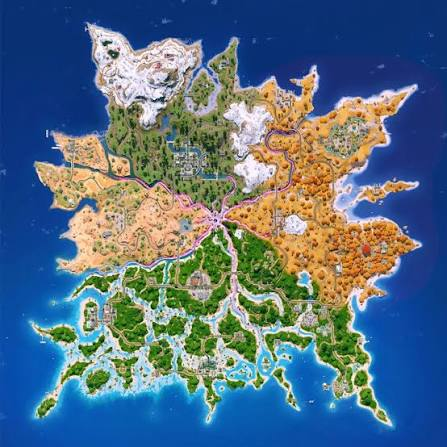

<!DOCTYPE html>
<html lang="pt-BR">
<head>
    <meta charset="UTF-8">
    <meta name="viewport" content="width=device-width, initial-scale=1.0">
    <title>Fortnite Loadout</title>

    
</head>

<body>

    <h1>Fortnite Loadout</h1>

    
Mapa da temporada

    

</body>
</html>
